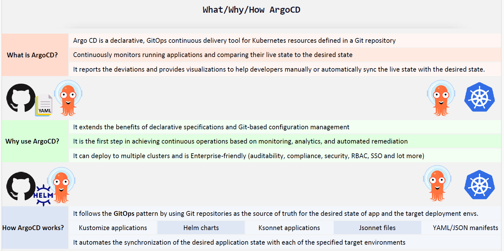
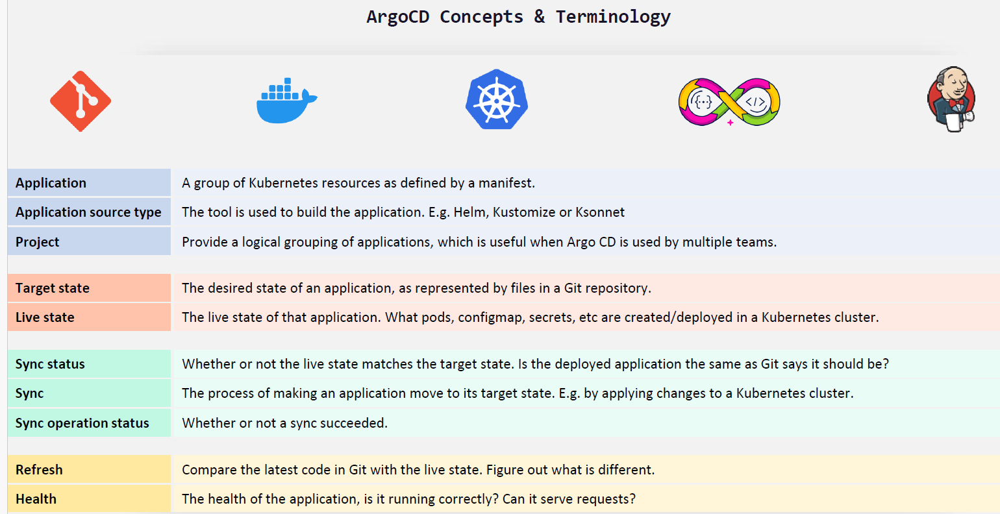
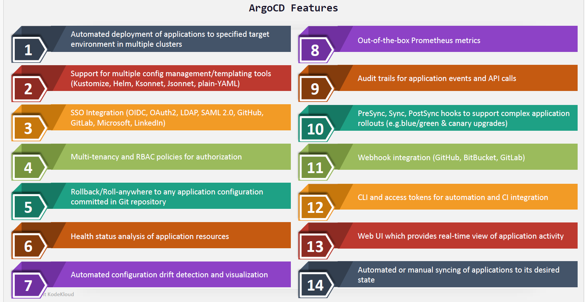
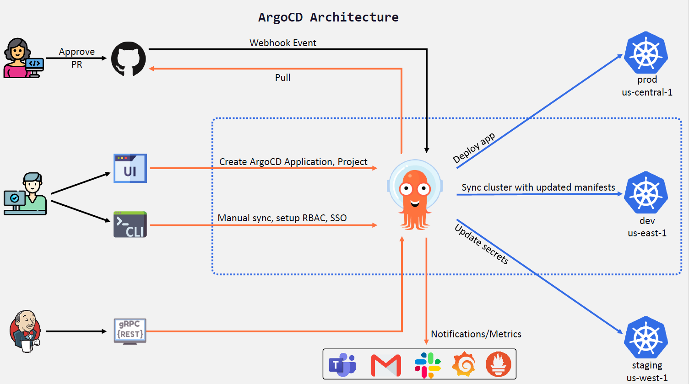
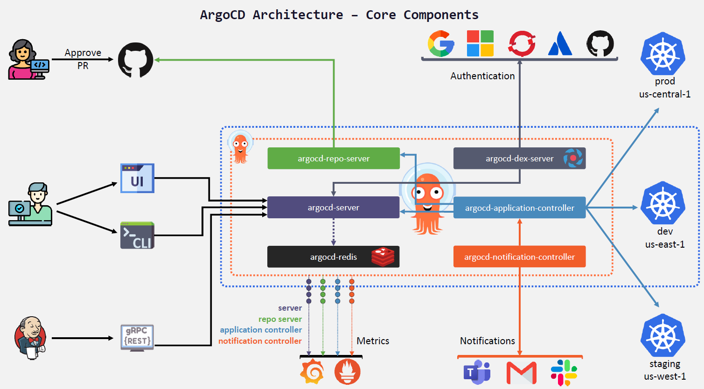

## Section 3: ArgoCD Basics











```sh
## ArgoCD Installation
# Ref: https://argo-cd.readthedocs.io/en/stable/operator-manual/installation/
kubectl create ns argocd
kubectl apply -n argocd -f https://raw.githubusercontent.com/argoproj/argo-cd/master/manifests/install.yaml

## ArgoCD CLI Installation
# Ref: https://argo-cd.readthedocs.io/en/stable/cli_installation/
mkdir 'C:\ArgoCD-CLI'
$version = (Invoke-RestMethod https://api.github.com/repos/argoproj/argo-cd/releases/latest).tag_name
$url = "https://github.com/argoproj/argo-cd/releases/download/" + $version + "/argocd-windows-amd64.exe"
$output = "argocd.exe"

Invoke-WebRequest -Uri $url -OutFile $output
[Environment]::SetEnvironmentVariable("Path", "$env:Path;C:\ArgoCD-CLI", "User")

argocd version

# Login to ArgoCD
$ kubectl port-forward svc/argocd-server -n argocd 8080:443
argocd login localhost:8080 --insecure  # Not working in Git Bash, so try in PowerShell

PS C:\Users\koarumug> argocd login localhost:8080 --insecure
    Username: admin
    Password:
    'admin:login' logged in successfully
    Context 'localhost:8080' updated
PS C:\Users\koarumug> argocd cluster list
    SERVER                          NAME        VERSION  STATUS   MESSAGE                                                  PROJECT
    https://kubernetes.default.svc  in-cluster           Unknown  Cluster has no applications and is not being monitored.
PS C:\Users\koarumug> argocd app list
    NAME  CLUSTER  NAMESPACE  PROJECT  STATUS  HEALTH  SYNCPOLICY  CONDITIONS  REPO  PATH  TARGET
PS C:\Users\koarumug> argocd proj list
    NAME     DESCRIPTION  DESTINATIONS  SOURCES  CLUSTER-RESOURCE-WHITELIST  NAMESPACE-RESOURCE-BLACKLIST  SIGNATURE-KEYS  ORPHANED-RESOURCES
    default               *,*           *        */*                         <none>                        <none>          disabled

PS C:\Users\koarumug> argocd context
    CURRENT  NAME            SERVER
            kubernetes      kubernetes
    *        localhost:8080  localhost:8080
PS C:\Users\koarumug> argocd logout localhost:8080
    Logged out from 'localhost:8080'
```
